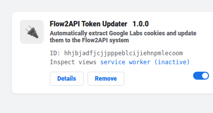
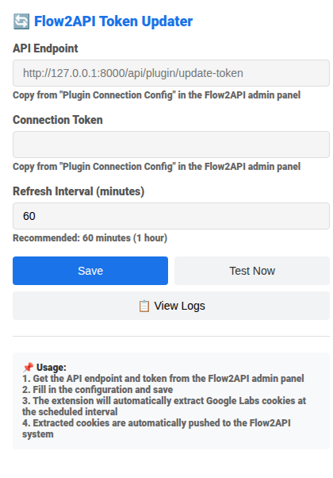
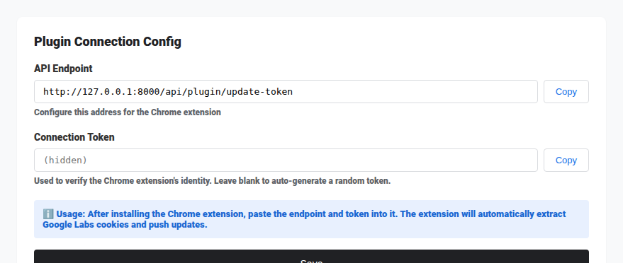

# Usage

Must be used together with [Flow2api](https://github.com/TheSmallHanCat/flow2api) service.

## 1. Installation

1. **Open the Extensions page**
   Enter the following URL in the Chrome address bar:
   `chrome://extensions/`

2. **Enable Developer mode**
   Toggle the **"Developer mode"** switch in the top-right corner of the page.
   

3. **Load the extension**
   Drag the unzipped extension folder directly onto the browser page, or click "Load unpacked" and select the folder.
   

## 2. Configuration

1. **Set the API endpoint and Token**
   Click the extension icon and configure the **API Endpoint** and **Connection Token** in the popup window. The default refresh interval is 60 minutes; 6 hours is generally recommended.
   

2. **Get configuration values**
   If you don't know what to fill in, log in to the **Flow2api admin panel** to find the endpoint URL and access key.
   
